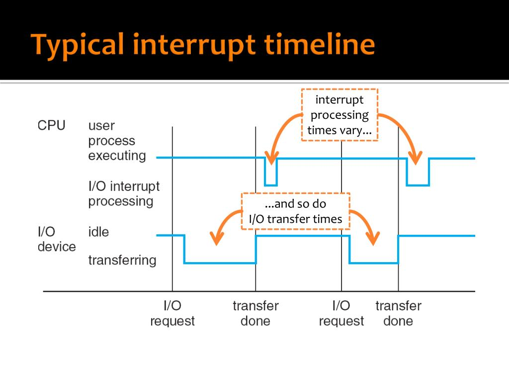

[[課程筆記] 作業系統概論（一） - 課程簡介＆中斷（Interrupt）](../2023-09-18-os-01/)
[[課程筆記] 作業系統概論（二） - 架構設計](../2023-10-26-os-02/)

---

期中考前主要圍繞的三大主題：
- 第三章：process
- 第四章：thread
- 第五章：scheduling

# 電腦開機啟動流程
1. 執行硬體預先定義好的 BIOS/UEFI，並且把 PC（program counter）設為 FFFF:0000。
2. 執行位於磁碟最開頭（首個磁區） 512 Byte 的 MBR（Master Boot Record），她會尋找並引導啟動作業系統（e.g., Windows）的核心部份。
3. 作業系統被載入到記憶體中啟動。

# Interrupt（中斷）

CPU 一次只能做一件事，如果有一個事情需要等待（e.g., I/O 讀寫操作），就可以利用中斷來先去做其他的事情。

中斷可以分成：
* 硬體中斷：從外部來的中斷，也就是中斷請求（interrupt request；IRQ）e.g., I/O
* 軟體中斷：由於軟體發生的異常導致的中斷，又叫做 exception 或是 trap。e.g., 除以 0

兩種中斷在處理的流程上沒有太大差別。

## 範例流程

1. IO device 發出中斷訊號給 PIC
2. PIC 發中斷給 CPU
3. CPU 把目前在處理的東西（當前狀態 e.g., program counter, ...）先存起來
4. CPU 查詢 IVT（interrupt vector table） 後跳到對應的 ISR（interrupt service routine） 執行
5. ISR 最後一個指令會是 IRET（return 回原本 CPU 處理的東西）

> IVT（中斷向量表）。位置固定（方便 CPU 查詢），通常放在記憶體位置為 0。

> 作業系統（or 驅動程式）要負責 ISR 的部份。

> 不要忘記會有延遲（latency ）

# I/O
一個 IO 基本上最花時間的部份是：
1. 在 IO device 處理的時間
2. IO device 傳到 memory 的 data transfer 時間

DMA 負責從 IO device（e.g., 磁碟）到 buffer in memory 的高速傳輸。（傳完送 inturrupt 給 CPU）

## Sync（blocking） vs. Async（non-blocking） I/O

| Function   | sync or async? | 說明                                                         |
|------------|----------------|--------------------------------------------------------------|
| read()     | sync           | 進行讀的 process 會需要 wait，CPU 會在這時去跑其他的 process。 |
| write()    | async          |                                                              |
| fsync()    | sync           | system call。可以看成 sync 版本的 write。                      |
| aio_read() | async          | async 的 read，用來做作 prefetch。                             |

> system call：kernel 提供的服務

# multiprogramming

process = job = task

為什麼要很多的 process？
像是前面提到屬於 sync 的 read()，如果 CPU 執行時遇到就會 blocking，此時若能利用這個 wait 的時間去執行其他的 process 就能節省時間。

## timesharing
除了前面所說 blocking 切換 process，經過一段固定的時間（透過 timer）自動切換到下一個 process。
如此一來可以達到像是均勻分配的效果。

time slice = time quantum

## 結論：timesharing ⊂ multitasking ⊂ multiprogramming 
* multiprogramming：載入很多 process 到 memory
* multitasking：multiprogramming 有 overlapped
* timesharing：要有 periodic switch

# Trap

trap 就是軟體中斷（interrupt）

例如，使用 `printf()`，因為要用到螢幕（硬體），所以一定是 kernel mode，所以會有 trap（user mode -> kernel mode）。

不要忘記中斷的流程（IVT, ISR, IRET）

# system call
## process control
- `fork()`
- `exit()`
- `wait()`

## File Manipulation
- `open()`
- `close()`
- `read()`
- `write()`

## Device Manipulation
- `ioctl()`
- `read()`
- `write()`

## Information Maintenance
- `getpid()`：目前的 process id
- `alarm()`
- `sleep()`

## Communication
- `pipe()`
- `shmget()`
- `mmap()`

## Protection
- `chmod()`
- `umask()`
- `chown()`

# Mechanism vs. Policy

Mechanism 不做決策

Policy 有決策（不會影響結果是否正確，主要影響效能問題）

