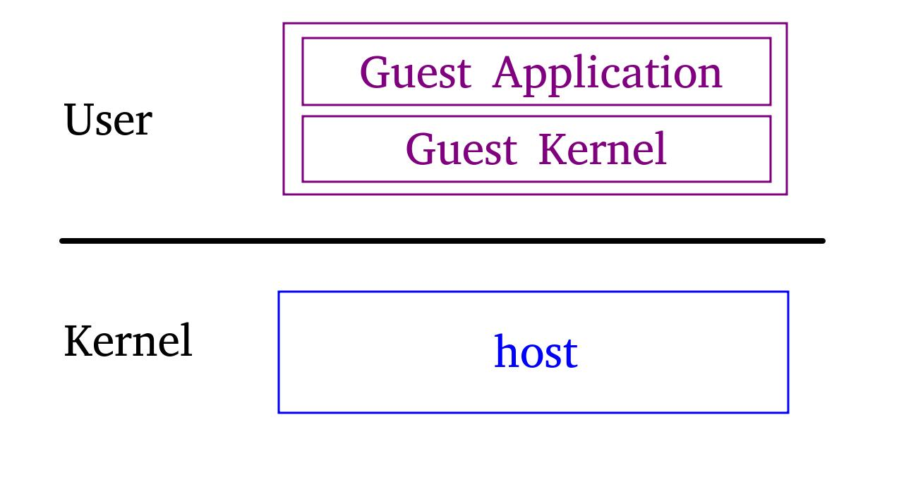
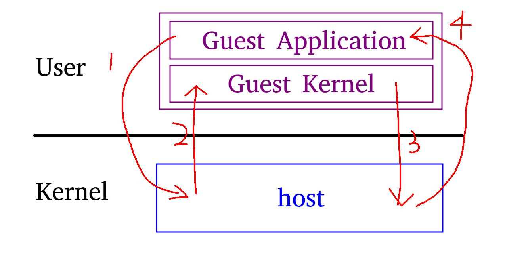

課程簡介：略

第三章：process
第四章：thread
第五章：scheduling

# 電腦開機
1. PC = FFFF:0000 執行 BIOS（現在電腦通常改成 UEFI）
2. 磁碟最開頭的 512 Bytes 叫做 MBR（負責尋找磁碟上的作業系統 e.g., Windows）


# Interrupt handling（中斷處理）

CPU 一次只能做一件事，如果有一個事情卡住，就可以透過中斷來去做別的事情。

分成：
* 硬體中斷：e.g., IO
* 軟體中斷：e.g., 除以 0

這兩種中斷基本上處理的流程一樣。

## 範例流程


1. IO device 發出中斷訊號給 PIC
2. PIC 發中斷給 CPU
3. CPU 把目前在處理的東西（當前狀態 e.g., program counter, ...）先存起來
4. CPU 查詢 IVT（interrupt vector table） 後跳到對應的 ISR（interrupt service routine） 執行
5. ISR 最後一個指令會是 IRET（return 回原本 CPU 處理的東西）

> IVT（中斷向量表）。位置固定（方便 CPU 查詢），通常放在記憶體位置為 0。

> 作業系統（or 驅動程式）要負責 ISR 的部份。


> 不要忘記會有延遲（latency ）

# I/O
一個 IO 基本上最花時間的部份是：
1. 在 IO device 處理的時間
2. IO device 傳到 memory 的 data transfer 時間

DMA 負責從 IO device（e.g., 磁碟）到 buffer in memory 的高速傳輸。（傳完送 inturrupt 給 CPU）

## Sync（blocking） vs. Async（non-blocking） I/O

| Function   | sync or async? | 說明                                                         |
|------------|----------------|--------------------------------------------------------------|
| read()     | sync           | 進行讀的 process 會需要 wait，CPU 會在這時去跑其他的 process。 |
| write()    | async          |                                                              |
| fsync()    | sync           | system call。可以看成 sync 版本的 write。                      |
| aio_read() | async          | async 的 read，用來做作 prefetch。                             |


> system call：kernel 提供的服務


# multiprogramming

process = job = task

為什麼要很多的 process？
像是前面提到屬於 sync 的 read()，如果 CPU 執行時遇到就會 blocking，此時若能利用這個 wait 的時間去執行其他的 process 就能節省時間。

## timesharing
除了前面所說 blocking 切換 process，經過一段固定的時間（透過 timer）自動切換到下一個 process。
如此一來可以達到像是均勻分配的效果。

time slice = time quantum

## 結論：timesharing ⊂ multitasking ⊂ multiprogramming 
* multiprogramming：載入很多 process 到 memory
* multitasking：multiprogramming 有 overlapped
* timesharing：要有 periodic switch


# OS 設計
## MS-DOS
- 簡單、沒有結構
- 沒有 protection（程式可以直接 access hardware）
- 一次只能執行一個程式


> [TSR = Terminate-and-stay-resident program](https://zh.wikipedia.org/zh-tw/%E7%BB%88%E6%AD%A2%E5%8F%8A%E5%B8%B8%E9%A9%BB%E7%A8%8B%E5%BC%8F)

## UNIX（Monolithic kernel；單體式、整合式核心）
和系統程式有關的都在 kernel 執行（有效率）


> 以前買一個印表機要安裝 driver 時，必須要有 kernel source code 和印表機 driver 的 source code 才能擴充（重新編譯 kernel）=> 不方便 => Modules 的概念出現

kernel module 範例：
參考[[Linux Kernel] 撰寫簡單 Hello, World module (part 1).
](https://blog.wu-boy.com/2010/06/linux-kernel-driver-%E6%92%B0%E5%AF%AB%E7%B0%A1%E5%96%AE-hello-world-module-part-1/)
```c
#include <linux/kernel.h> /* header file for structure pr_info */
#include <linux/init.h>
#include <linux/module.h> /* header file for all modules */
#include <linux/version.h>

MODULE_DESCRIPTION("Hello World !!");
MODULE_AUTHOR("Enfu Liao");
MODULE_LICENSE("GPL");

static int __init hello_init(void)
{
    pr_info("Hello, world\n");
    pr_info("The process is \"%s\" (pid %i)\n", current->comm, current->pid);
    return 0;
}

static void __exit hello_exit(void)
{
    printk(KERN_INFO "Goodbye\n");
}

module_init(hello_init);
module_exit(hello_exit);
```

```makefile
obj-m := hello.o

KERNELDIR ?= /lib/modules/$(shell uname -r)/build

all default: modules
install: modules_install

modules modules_install help clean:
    $(MAKE) -C $(KERNELDIR) M=$(shell pwd) $@
```

> 看起來一般程式沒什麼不同，不過可以去做一些 kernel 才能做的事情。（不過要是 root 才能 insert/remove module）

```sh
insmod ./hello.ko # 載入 module
rmmod  ./hello.ko # 移除 module
```


## Microkernel

一些基本的留在 kernel（如下），其他的東西放到 user space
- CPU schedule
- IPC


優點（和單體式比較）：
1. 更好 extend
2. 更安全（kernel 更小、更不容易進到 kernel mode）
3. 移植比較簡單
4. robust

缺點：
1. performance 比較差。使用場景大多是嵌入式系統（效能相比安全性等非主要考量）

參考：https://en.wikipedia.org/wiki/Tanenbaum%E2%80%93Torvalds_debate

> INTEL ME（Intel Management Engine）有一個 MINIX（買 CPU 送你作業系統:D）


Google Fuchsia 是 Microkernel，客群是 IoT devices。
UI：Flutter (UI framework) + Dart (language) 
system services and IPC：Fuchsia
microkernel：Zircon


## Mac OS X
變形 Microkernel


> Steve Jobs 在 NeXT 開發，之後帶回到 Apple。


# 虛擬機
虛擬機跑在 user mode（就是一個 process）


system call（interrupt）：



## Java 虛擬機（JVM）
> non-native execution

> Android - ART vs Dalvik
> Approach: ART uses AOT(Ahead Of Time) approach and compiles the whole code during the installation time but the Dalvik uses JIT(Just In Time) approach and complies only a part of the code during installation and rest of the code will be compiled dynamically.

> https://en.wikipedia.org/wiki/Acquisition_of_Sun_Microsystems_by_Oracle_Corporation


# Process（行程）
process = job = task = a program **in execution**
- text
- stack：local variable
- heap：全域變數
- data
- program counter, CPU registers


--> 2023-09.27


