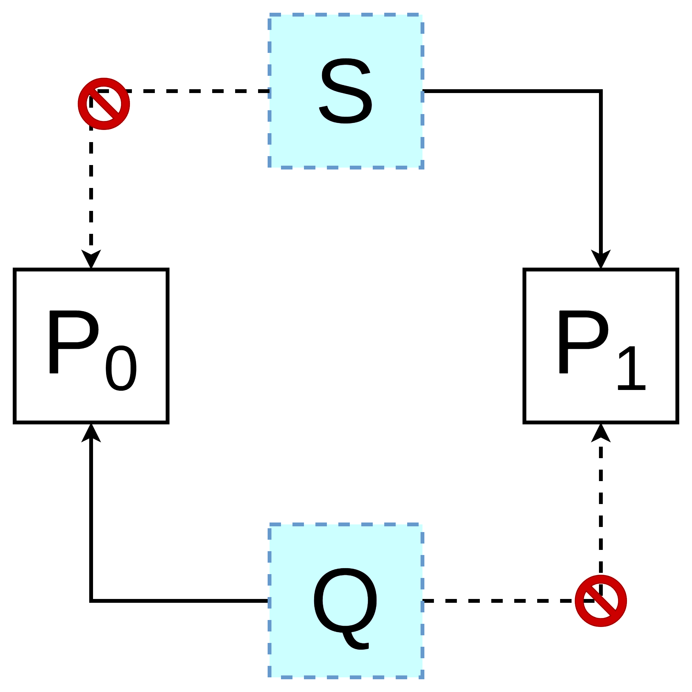

這章老師說會比較難><

:-D

Sync 不能不做（程式正確性問題）。

Sync 四大問題：
1. Bounded-Buffer Problem
2. Readers–Writers Problem
3. Dining-Philosophers Problem
4. Sleeping Barber Problem

# Race Condition

以 counter 為例子，我們前面用 counter 去計算 buffer 裡面有多少個，但是這其實會產生 race condition 的問題。

```c
// producer
while (TRUE) {
    while (count == BUFFER_SIZE)
        ;
    buffer[in] = nextProduced;
    in = (in + 1) % BUFFER_SIZE;
    count++;
}
```

```c
// consumer
while (TRUE) {
    while (count == 0)
        ;
    nextConsumed = buffer[out];
    out = (out + 1) % BUFFER_SIZE;
    count--;
}
```

`count++` 在 C 語言看起來只有一行，但是轉成指令會是很多行（有可能是以下三行，取決於 CPU 架構）。

`count++` 不是 atomic operation（atomic operation 指的是不能再被分割）。

```
# assembly code of count++
reg1 = count
reg1 = reg1 + 1
count = reg1
```

```
# assembly code of count--
reg1 = count
reg1 = reg1 + 1
count = reg1
```

假設有 `count++` 和 `count--` 同時發生，他們的指令可能會互相參差，造成結果不同（三種結果只有一個是對的）。

這時候可能會想到用一個 `safe` 變數去紀錄是否有其他的 thread 在讀/寫 `count`。

```
// thread 1
if (safe == TRUE)
    safe = FALSE;
    // do something...
```

不過因為 `safe == TRUE` 和 `safe = FALSE` 也不是 atomic，所以問題還是沒解決。


另一個 race condition 的例子（linked list 插入）：


總結來說，race condition 的主要原因就是因為 operation 不是 atomic。

## 解決

### hardware-based approaches

這邊先講一下 hardware-based approaches（硬體底層實做）是如何解決 race condition。

架構：
```c
do {
    // entry section
        <CRITICAL SECTION>
    // exit section
        <REMAINDER SECTION> // 之後我會用 ... 表示
}
```

其中，critical section 要滿足三個條件：
1. *Mutual Exclusion（互斥）*：當有一個 process 佔住 critical-section 時，其他 process 不能進入 critical section，不會有兩個 process 同時間在 critical-section 中工作。
2. *Progress*：當沒有 process 要在 critical-section 中執行時，不能阻擋其他想要進入 critical section 工作的 process 進入 critical-section，要選擇其中一個候選 process 進入 critical-section，不能空在那邊。
3. *Bounded Waiting*：等待 critical-section 的時間，不能是無窮大的時間，是有個界線。也就是說，不能佔住了critical-section 就不出來了。

#### disable/enable interrupt

在要進行 critical section（會發生 race condition 的部份），之前先 disable interrupt，等到執行完在 enable interrupt（在 kernel mode 開啟/關閉 interrupt）。

```c
do {
    disable interrupt; // entry section
    <CRITICAL SECTION>
    enable interrupt; // exit section
    
    ...

} while (TRUE)
```

不過這方法在多處理器（multiprocessor）的環境下是沒有用的（因為你還是沒辦法阻止其他 CPU 去動到資料）。

#### 包裝成 atomic instruction

使用 TAS 指令：

```c
// TAS（在這邊的程式碼只是表示，在硬體已經實做出來，並非是一個 C 語言函數）
boolean TestAndSet(boolean *target)
{
    boolean rv = *target;
    *target = TRUE;
    return rv;
}

// Solution（使用 TAS 指令解決 race condition 的 C 程式）
do {
    while (TestAndSet(&lock))
        ;

    <CRITICAL SECTION>
    lock = FALSE;
    
    ...
} while(TRUE);
```

使用 Swap 指令：

```c
// Swap（在這邊的程式碼只是表示，在硬體已經實做出來，並非是一個 C 語言函數）
void Swap(boolean *a, boolean *b)
{
    boolean temp = *a;
    *a = *b;
    *b = temp:
}

// Solution（使用 Swap 指令解決 race condition 的 C 程式）
do {
    key = TRUE;
    while(key == TRUE)
         Swap(&lock, &key);

    <CRITICAL SECTION>
    lock = FALSE;
    
    ...
} while (TRUE);
```

Spin Lock：

```x86asm
; Intel syntax

locked:                      ; The lock variable. 1 = locked, 0 = unlocked.
     dd      0

spin_lock:
     mov     eax, 1          ; Set the EAX register to 1.

     xchg    eax, [locked]   ; Atomically swap the EAX register with
                             ;  the lock variable.
                             ; This will always store 1 to the lock, leaving
                             ;  the previous value in the EAX register.

     test    eax, eax        ; Test EAX with itself. Among other things, this will
                             ;  set the processor's Zero Flag if EAX is 0.
                             ; If EAX is 0, then the lock was unlocked and
                             ;  we just locked it.
                             ; Otherwise, EAX is 1 and we didn't acquire the lock.

     jnz     spin_lock       ; Jump back to the MOV instruction if the Zero Flag is
                             ;  not set; the lock was previously locked, and so
                             ; we need to spin until it becomes unlocked.

     ret                     ; The lock has been acquired, return to the calling
                             ;  function.

spin_unlock:
     mov     eax, 0          ; Set the EAX register to 0.

     xchg    eax, [locked]   ; Atomically swap the EAX register with
                             ;  the lock variable.

     ret                     ; The lock has been released.
```

### pure-software approaches

軟體解決

#### Peterson's solution

醜醜 der。

#### Semaphores

好像又是 dijkstra 想出來的 Orz。

兩個 operation：
- signal() 或是叫做 V（荷蘭語 increase）：
- wait() aka P（荷蘭語 test, try, pass, grab）：

```c
wait(S) {
    S--;
    if (S < 0) {
        // add this process to waiting queue（變成 waiting 狀態）
        block();
    }
}

signal(S) {
    S++;
    if (S <= 0) {
        // remove a process P from the waiting queue（變成 ready 狀態）
        wakeup(P);
    }
}
```


# Semaphores 三大應用

## MUTEX：前面講過
```
init = 1
```

## sequencing or event
```
init = 0
```

precedence constraint

確保先做完 S1 才做 S2。

```
pi {
    S1;
    signal(sync);
}

pj {
    wait(sync);
    S2;
}
```

## 容量控制（capacity control）
```
init > 1
```

e.g., 限制 server 同一時間可以服務多少人。


# Semaphore 範例：DMA

只有四個通道，每個通道一次只能有一個 process 在用。

```
S = 4;
T = 1;
c[4] = { F, F, F, F };

proc()
{
    wait(S);
    wait(T);

    // pick one unused channel among c[0], c[1], c[2], c[3]
    // setup DMA transfer

    signal(T);

    // start DMA
    // wait for DMA completion

    signal(S);
}
```

# Semaphore 範例：Bounded-Buffer Problem
前面講過的問題。

解法（三個 semaphore）：
1. semaphore `MUTEX = 1` 保護 buffer
2. for consumer -> semaphore `FULL = 0` 確保空的時候不能再拿
3. for producer -> semaphore `EMPTY = N` 確保滿的時候不能再給


# Deadlock & Starvation

Deadlock：如下圖




Starvation：某個 process 要資源但是一直要不到


# 哲學家就餐問題（Dining-Philosophers Problem）

參考：https://en.wikipedia.org/wiki/Dining_philosophers_problem

五個哲學家（思考、等待、吃飯）坐一圈，每個人左右都有一支筷子（總共五支）。

每個人吃飯都要兩支筷子（先拿左邊再拿右邊），且只能用自己手邊的筷子。

每個人遵守以下操作：
```
1. think unless the left chopstick is available; when it is, pick it up;
2. think unless the right chopstick is available; when it is, pick it up;
3. when both chopstick are held, eat for a fixed amount of time;
4. put the left chopstick down;
5. put the right chopstick down;
6. repeat from the beginning.
```

死結：當所有哲學家都拿起自己左邊的筷子。


# 讀寫問題（Readers–writers Problem）

reader：只能讀

writer：可以讀、寫


# 問題

The TAS/SWAP instruction as a solution of the critical section problem guarantees which one(s) of the
following properties?
- Mutual exclusive
- Progressive
- Bounded waiting

答案：Mutual exclusive、Progressive

所以有 based on TAS/SWAP 且滿足 bounded waiting 解法：
```c
do {
    waiting[i] = TRUE;
    key = TRUE;
    while (waiting[i] && key)
        key = TestAndSet(&lock);
    
    waiting[i] = FALSE;

    <CRITICAL SECTION>

    j = (i + 1) % n;
    while ((j != i) && !waiting[j])
        j = (j + 1) % n;

    if (j == i)
        lock = FALSE;
    else
        waiting[j] = FALSE;
    
    ...
} while(TRUE);
```


# 參考
- [自旋鎖](https://zh.wikipedia.org/zh-tw/%E8%87%AA%E6%97%8B%E9%94%81)
- [Semaphore (programming)](https://en.wikipedia.org/wiki/Semaphore_(programming))
- [06. 同步 (Synchronization)](https://sls.weco.net/node/21326)