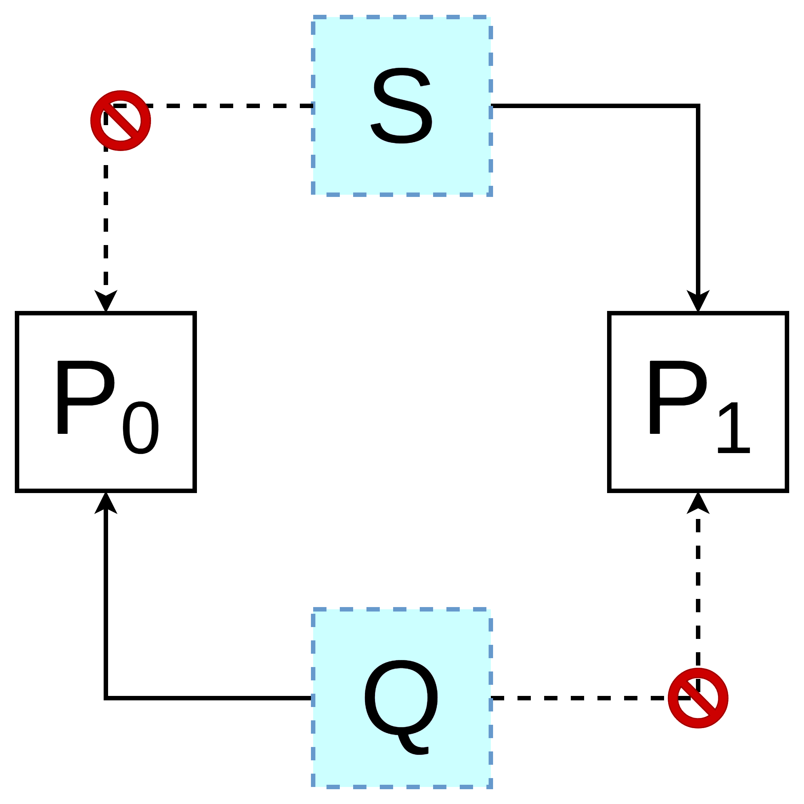

這邊基本上是延續上一章的內容。

# Deadlock & Starvation

Deadlock：如下圖



Starvation：某個 process 要資源但是一直要不到

# 哲學家就餐問題（Dining-Philosophers Problem）

參考：https://en.wikipedia.org/wiki/Dining_philosophers_problem

五個哲學家（思考、等待、吃飯）坐一圈，每個人左右都有一支筷子（總共五支）。

每個人吃飯都要兩支筷子（先拿左邊再拿右邊），且只能用自己手邊的筷子。

每個人遵守以下操作：
```
1. think unless the left chopstick is available; when it is, pick it up;
2. think unless the right chopstick is available; when it is, pick it up;
3. when both chopstick are held, eat for a fixed amount of time;
4. put the left chopstick down;
5. put the right chopstick down;
6. repeat from the beginning.
```

死結：當所有哲學家都拿起自己左邊的筷子。


# Characterization

```
P -> q1 ^ q2 ^ q3 ^ q4
```


P \implies q_{1} \land q_{2} \land q_{3} \land q_{4}



- P: Deadlock
- q_{1}: Mutual Exclusion（同一時間只能有一個人用）
- q_{2}: Hold and wait
- q_{3}: No preemption
- q_{4}: Circular wait

所以有：


\neg q_{1} \lor \neg q_{2} \lor \neg q_{3} \lor \neg q_{4} \implies P



# 圖示


有環不一定就是 deadlock。


# ??

- prevention = avoidance：不會有 deadlock
- detection = recovery：可以有 deadlock，會 recovery


## Prevention

之後補（ch7 p19）

從 no preemption 下手，使用 checkpoint mechanism。

從 circular wait 下手，使用 total/partial ordering


## Avoidance

分配之前先試試看，如果偵測有環就拒絕。
