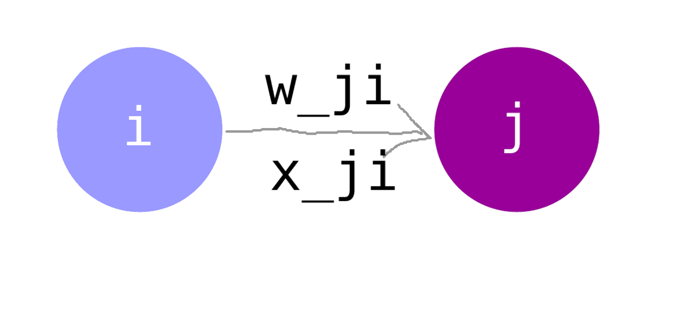

一個神經元：


1. linear compination of all inputs
2. activation function e.g., step function


# Perceptron

對單一神經元來說，輸入多個 Binary，輸出一個 Binary。

假設是 2D feature space（只有 2 個 feature）。

```
    | x1 | x2 | target
------------------------
 #1 | ?  | ?  |  +
 #2 | ?  | ?  |  +
 #3 | ?  | ?  |  -
    |    |    |
    |    |    |
    |    |    |    
```


\sum_{i=1}^{n} w_{i}x_{i} + b \ge 0


引入 w0 的表示可以讓原本要分開處理的 bias 更為簡潔。

怎麼理解 b？其實就是 threshold，當超過 threshold 時輸出 1，否則輸出 0。


\sum_{i=0}^{n} w_{i}x_{i} \ge 0
x_{0} = 1


第一層（input layer）的神經元數量會等同於 feature 的數量。


## Sigmoid Function

1. 連續
2. 可微
3. nonlinear


### Error


E = \frac{1}{2} \sum_{i}^{100} (t_{i} - o_{i})^{2}



- t_{i}: true value
- o_{i}: prediction
- \frac{1}{2} 只是為了計算梯度偏微分時可以跟 2 冪次方消掉（計算上方便）


何時會讓 Error 最小？計算 Partial Derrivative。


計算微分太困難了。


